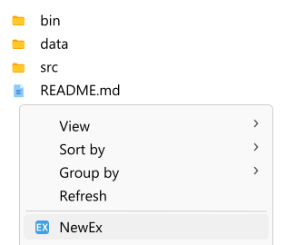
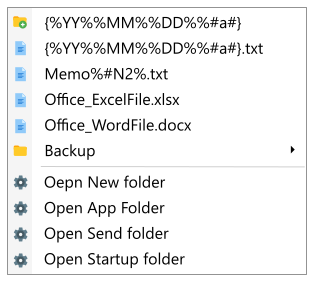

# NewEx


* [README (Japanese)](README_ja.md)

"NewEx" is an application for Windows. It adds useful functions to the Explorer context menu.

After installation, click "NewEx" in the context menu to execute various functions.

**Explorer context menu**



**Click "NewEx" to display the menu**




## Features

Depending on how the context menu is opened, "NewEx" has different functions.

* Displayed from "**Blank part of folder**".
    * "**File tree**"
        1. files and folders in "new-ex/data/new/" are displayed in a hierarchical tree.
        2. selected files are copied to the folder where the context menu is displayed.
        3. when copying, the files are renamed with the conversion rules written in the file name.
    * "**Basic Menu**"
        * Open a new folder (new-ex/data/new/)
        * Open application folder (new-ex/)
        * Open send folder (new-ex/data/new/) * Open startup folder (new-ex/)
        * Open startup folder
* Display from "**File Selection**"
    * Rename with the conversion rules in the configuration file.
* Display from "**Select Folder**".
    * Rename with the conversion rules of the configuration file.


## Execution example

### Example 1

1. right-click on the "blank part of the folder" in Explorer to display the context menu.
2. Select "NewEx".
3. The menu appears.
4. Select "{%YY%%MM%%%DD%%#a%}.txt".
5. A file named "230626.txt" is created in Explorer.
    * If there is another file with the same name, it is "230626b.txt".
    * "230626c.txt" if there is another file with the same name.

### example 2

1. right-click on the "blank part of the folder" in Explorer to display the context menu.
2. Select "NewEx".
3. The menu appears.
4. Select "Open Send folder".
5. Open a new Explorer and display the "Send Folder".

### Example 3

1. select the file "hoge.txt" in Explorer and right-click to display the context menu.
2. select "NewEx".
3. The file "hoge.txt" is renamed to "230626 hoge.txt".
    * If there is another file with the same name, it is "230626b hoge.txt".
    * "230626c hoge.txt" if there is another file with the same name.

### Example 4

1. select the folder "hoge" in the Explorer and right-click to display the context menu.
2. select "NewEx".
3. The folder "hoge" is renamed to "230626 hoge".
    * If there is another folder with the same name, it is "230626b hoge".
    * "230626c hoge" if there is another folder with the same name.


## Dependencies

This application is developed with "Microsoft .NET SDK 7.0.305".

"NET 7.0" execution environment is required to run this application.

If you do not have an execution environment, obtain "SDK 7.0.305" or ".NET Desktop Runtime 7.0.8" from the following site.

> .NET 7.0  
> https://dotnet.microsoft.com/en-us/download/dotnet/7.0

You can check which ".NET" is present in your OS by doing the following

1. go to Windows Settings and select "Apps" > "Installed Apps".
2. search for ".net". A list will appear.


## Install and uninstall

To install, run "install.bat". Add necessary settings to the registry.

Run "settings.bat" to configure initial settings such as language. Generate "data/config.user.json".

The default language is "Japanese".

To uninstall, run "uninstall.reg". This will remove the settings from the registry.


## File Structure

* new-ex/ ...... Application root
    * bin/ ...... Executable files
    * data/ ...... Data
        * icon/ ...... Contains PNG files to be used as menu icons
        * new/ ...... Contains files for creating new files to be displayed in the hierarchy tree
            * backup/ ...... Folders that categorize files
            * {%YY%%MM%%%DD%%#a%}.folder ...... Create folders with year and month dates such as "230626" and "230626b"
            * {%YY%%MM%%DD%%#a%}.txt ...... Create text files with year and month dates like "230626.txt" and "230626b.txt"
            * Office_WordFile.docx ...... Create a WORD file like "Office_WordFile.docx".
            * Office_ExcelFile.xlsx ...... Create an EXCEL file like "Office_ExcelFile.xlsx"
            * Memo%#N2%.txt ...... Create text files like "Memo01.txt" and "Memo02.txt
        * config.json ...... Configuration file
    * src/ ...... Source files


## File name conversion rules

### Basic Conversion Rules

The following are the file name conversion rules.

|description|conversion rules          |
|:--        |:--                       |
|%YYYY%     |4-digit year like "2023". |
|%YY%       |2-digit year like "23".   |
|%M%        |Plain month like "6".     |
|%MM%       |2-digit month like "06".  |
|%D%        |Plain day like "3".       |
|%DD%       |2-digit day like "03".    |
|%h%        |Plain hours like "1".     |
|%hh%       |2-digit hours like "01".  |
|%m%        |Plain minutes like "2".   |
|%mm%       |2-digit hour like "02".   |
|%s%        |Plain seconds like "3".   |
|%ss%       |2-digit seconds like "03".|
|%#a%       |Sequential number like "(blank)", "b", "c"... "z", "za", "zb"...|
|%#_a%      |Sequential number like "(blank)", "_b", "_c"... "_z", "_za", "_zb"...<br>Text written on the left and right side of "a" is inserted.|
|%#A%       |Sequential number like "a", "b", "c"... "z", "za", "zb"...      |
|%#n%       |Sequential number like "(blank)", "2", "3"...                   |
|%#_n%       |Sequential number like "(blank)", "_2", "_3"...<br>Text written on the left and right side of "n" is inserted.|
|%#N%       |Sequential numbers like "1", "2", "3"...                        |
|%#N2%      |Sequential number like "01", "02", "03"...etc. The number after "N" is the number of digits.|

### Grouping

Grouping is defined as "{ }" in the following format: "{%YY%%MM%%DD%%%#a%}.txt".

If there are files and folders in the same folder that match the "{ }", the sequential numbering will be advanced to the next one.

Only one group can be created.

### Folder creation file

If the extension is ".folder", a folder is created instead of a file.

### Additional conversion rules when renaming

The following additional conversion rules are applied when renaming.

|description|conversion rules            |
|:--        |:--                         |
|%bs%       |File name without extension.|
|%ext%      |Extension.                  |

### Conversion rules for menu_base

The following conversion rules apply to "menu_base" in the configuration file.

|description|conversion rules            |
|:--        |:--                         |
|%app_dir%    |Directory containing the application's executable files.|
|%USERPROFILE%|User directories (corresponding to Windows environment variables).|


## Configuration file

The configuration file is in JSON with the following contents.

```js
{
    "menu": {
        "font_size": 12     // Font size
    },
    "rename": {
        "file": "{%YY%%MM%%DD%%#a%} %bs%%ext%", // Conversion rules when renaming a file
        "dir": "{%YY%%MM%%DD%%#a%} %bs%"        // Conversion rules when renaming a folder
    },
    "menu_new": {
        "dir": "..\\data\\new"  // Path for new creation
    },
    "menu_base": [  // Menu basic (array format)
        {
            "text": "Oepn new folder",     // Display name
            "app": "explorer",                  // Command or application to execute path
            "args": "%app_dir%\\..\\data\\new"  // Arguments
        },
        ︙
    ]
}
```


