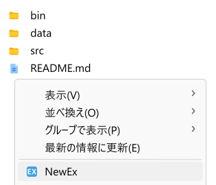
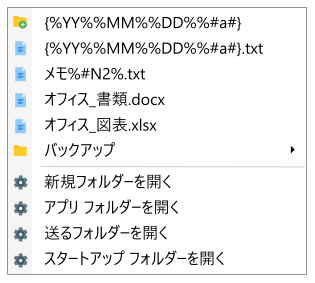

# NewEx / 新規作成EX


* [README (English)](README.md)
* [開発経緯](dev_history_ja.md)

「**NewEx**」（日本語名「新規作成EX」）は、Windows向けアプリケーションです。エクスプローラーのコンテキストメニューに便利な機能を追加します。

インストール後に、コンテキストメニューの「NewEx」をクリックすると各種機能が実行されます。

**エクスプローラーのコンテキストメニュー**



**「NewEx」をクリックしてメニューを表示**




## 主な機能

コンテキストメニューの開き方で、「NewEx」は機能が変わります

* 「**フォルダのブランク部分**」から表示
    * 「**ファイルツリー**」
        1. 「new-ex/data/new/」内にあるファイルとフォルダーが階層ツリーで表示される。
        2.  選択したファイルが、コンテキストメニューを表示したフォルダににコピーされる。
        3. コピー時に、ファイル名に書いた変換規則でリネームする。
    * 「**基本メニュー**」
        * 新規フォルダー（new-ex/data/new/）を開く
        * アプリ フォルダー（new-ex/）を開く
        * 送るフォルダーを開く
        * スタートアップ フォルダーを開く
* 「**ファイル選択**」から表示
    * 設定ファイルの変換規則でリネームする。
* 「**フォルダ選択**」から表示
    * 設定ファイルの変換規則でリネームする。


## 実行例

### 例1

1. エクスプローラーの「フォルダのブランク部分」を右クリックしてコンテキストメニューを表示。
2. 「NewEx」を選択。
3. メニューが表示。
4. 「{%YY%%MM%%DD%%#a%}.txt」を選択。
5. エクスプローラーに「230626.txt」というファイルが作られる。
    * 同名ファイルがある場合は「230626b.txt」。
    * さらに同名ファイルがある場合は「230626c.txt」。

### 例2

1. エクスプローラーの「フォルダのブランク部分」を右クリックしてコンテキストメニューを表示。
2. 「NewEx」を選択。
3. メニューが表示。
4. 「送るフォルダーを開く」を選択。
5. 新しいエクスプローラーを開き、「送るフォルダ」を表示する。

### 例3

1. エクスプローラーで「hoge.txt」というファイルを選択して右クリックしてコンテキストメニューを表示。
2. 「NewEx」を選択。
3. 「hoge.txt」というファイルが「230626 hoge.txt」にリネームされる。
    * 同名ファイルがある場合は「230626b hoge.txt」。
    * さらに同名ファイルがある場合は「230626c hoge.txt」。

### 例4

1. エクスプローラーで「hoge」というフォルダーを選択して右クリックしてコンテキストメニューを表示。
2. 「NewEx」を選択。
3. 「hoge」というフォルダーが、「230626 hoge」にリネームされる。
    * 同名フォルダーがある場合は「230626b hoge」。
    * さらに同名フォルダーがある場合は「230626c hoge」。


## 依存

本アプリケーションは「Microsoft .NET SDK 7.0.305」で開発しています。

本アプリケーションの実行には「.NET 7.0」の実行環境が必要です。

実行環境がない場合は、以下のサイトから「SDK 7.0.305」あるいは「.NET デスクトップ ランタイム 7.0.8」を入手します。

> .NET 7.0  
> https://dotnet.microsoft.com/ja-jp/download/dotnet/7.0

OSに、どの「.NET」が存在しているかは、以下の方法で確認できます。

1. Windowsの設定から「アプリ」＞「インストールされているアプリ」を選択。
2. 「.net」で検索。一覧が表示される。


## インストールとアンインストール

インストールをおこなうには「install.bat」を実行します。レジストリに必要な設定を追加します。

言語などの初期設定をおこなうには「settings.bat」を実行します。「data/config.user.json」を生成します。

未設定時の言語は「日本語」です。

アンインストールをおこなうには「uninstall.reg」を実行します。レジストリから設定を削除します。


## ファイル構成

* new-ex/ …… アプリケーションのルート
    * bin/ …… 実行ファイル
    * data/ …… データ
        * icon/ …… メニューのアイコンとして利用するPNGファイルがある
        * new/ …… 階層ツリーで表示される新規作成用ファイルがある
            * バックアップ/ …… ファイルを分類したフォルダ
            * {%YY%%MM%%DD%%#a%}.folder …… 「230626」「230626b」のような年月日のフォルダを作る
            * {%YY%%MM%%DD%%#a%}.txt …… 「230626.txt」「230626b.txt」のような年月日のテキストファイルを作る
            * オフィス_書類.docx …… 「オフィス_書類.docx」のようなWORDファイルを作る
            * オフィス_図表.xlsx …… 「オフィス_図表.txlsx」のようなEXCELファイルを作る
            * メモ%#N2%.txt …… 「メモ01.txt」「メモ02.txt」のようなテキストファイルを作る
        * config.json …… 設定ファイル
    * src/ …… ソースファイル


## ファイル名の変換規則

### 基本変換規則

以下はファイル名の変換規則です。

|記述  |変換ルール                                                 |
|:--   |:--                                                        |
|%YYYY%|「2023」のような4桁の年。                                  |
|%YY%  |「23」のような2桁の年。                                    |
|%M%   |「6」のようなプレーンな月。                                |
|%MM%  |「06」のような2桁の月。                                    |
|%D%   |「3」のようなプレーンな日。                                |
|%DD%  |「03」のような2桁の日。                                    |
|%h%   |「1」のようなプレーンな時。                                |
|%hh%  |「01」のような2桁の時。                                    |
|%m%   |「2」のようなプレーンな分。                                |
|%mm%  |「02」のような2桁の分。                                    |
|%s%   |「3」のようなプレーンな秒。                                |
|%ss%  |「03」のような2桁の秒。                                    |
|%#a%  |「（空文字）」「b」「c」…「z」「za」「zb」…のような連番。|
|%#_a%  |「（空文字）」「_b」「_c」…「_z」「_za」「_zb」…のような連番。<br>aの左右に書いた文字が挿入される。|
|%#A%  |「a」「b」「c」…「z」「za」「zb」…のような連番。         |
|%#n%  |「（空文字）」「2」「3」…のような連番。                   |
|%#_n%  |「（空文字）」「_2」「_3」…のような連番。<br>nの左右に書いた文字が挿入される。|
|%#N%  |「1」「2」「3」…のような連番。                            |
|%#N2% |「01」「02」「03」…のような連番。Nのあとの数字は桁数。    |

### グループ化

「{%YY%%MM%%DD%%#a%}.txt」のように「{ }」が付いている部分はグループ化です。

「{ }」内が一致するファイルやフォルダーが同じフォルダー内にあれば、連番を次に進めます。

このグループは1つしか作れません。

### フォルダ生成用ファイル

拡張子が「.folder」の場合は、ファイルではなくフォルダーを作成します。

### リネーム時の追加変換規則

リネーム時には、追加で次の変換規則が適用されます。

|記述 |変換ルール                |
|:--  |:--                       |
|%bs% |拡張子を除いたファイル名。|
|%ext%|拡張子。                  |

### menu_baseの変換規則

設定ファイルの「menu_base」では、次の変換規則が適用されます。

|記述         |変換ルール                                        |
|:--          |:--                                               |
|%app_dir%    |アプリケーションの実行ファイルがあるディレクトリ。  |
|%USERPROFILE%|ユーザーディレクトリ（Windowsの環境変数に対応）。|


## 設定ファイル

設定ファイルは、以下の内容のJSONになっています。

**config.json**

```js
{
    "menu": {
        "font_size": 12     // フォントのサイズ
    },
    "rename": {
        "file": "{%YY%%MM%%DD%%#a%} %bs%%ext%", // ファイルのリネーム時の変換規則
        "dir": "{%YY%%MM%%DD%%#a%} %bs%"        // フォルダーのリネーム時の変換規則
    },
    "menu_new": {
        "dir": "..\\data\\new"  // 新規作成のパス
    },
    "menu_base": [  // 基本メニュー（配列形式）
        {
            "text": "新規フォルダーを開く",     // 表示名
            "app": "explorer",                  // 実行するコマンドやアプリケーションのパス
            "args": "%app_dir%\\..\\data\\new"  // 実行時の引数
        },
        ︙
    ]
}
```


